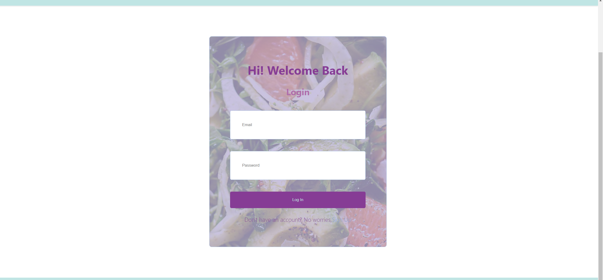
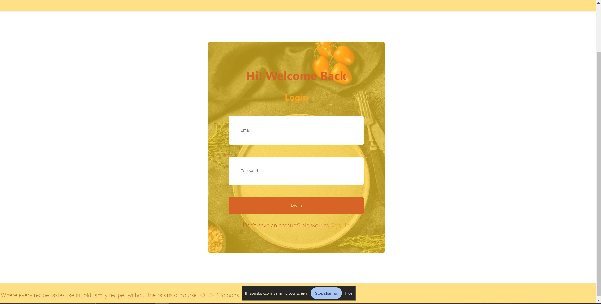
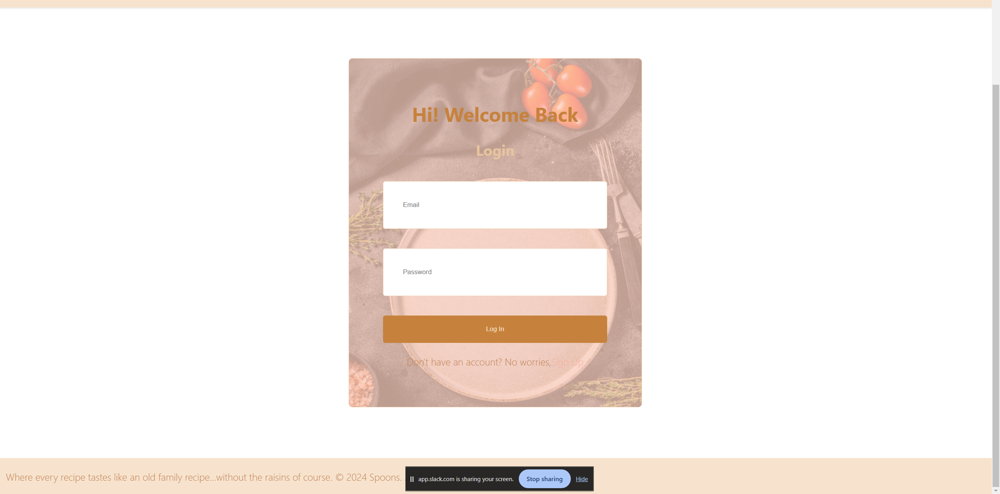

# Spoons

## Description

Why pluck your hair trying to remember a recipe your great-grandmother's father's aunt's third cousin made once when you visited when you can join a community that shares and tries out each other's recipes. It is like come dine with me but not really in person. Spoons is a WebApplication that brings people from all over the world to be a part of a network that just loves food and does not gatekeep family recipes or new recipes they have found in their journey of discovering flavors/flavours(depending on which part of the world you are from).

## Table of Contents:

- [Deployed Link](#Deployed-Link)
- [Github Repository](#Github-Repository)
- [Technologies Used](#Technologies-Used)
- [Getting Started](#Getting-Started)
- [Screenshots](#Screenshots)
- [Authors](#Authors)

## Overview

### Deployed Link

- [Click Here](https://spoons.onrender.com/login)

### Github Repository

- [Spoons](https://github.com/TylerJMalone/recipe-tracker)

### Technologies Used

```md
- React
- GraphQL
- MongoDB
- Render
```

### API(s)

Recipe finding API: [Spoonacular](https://spoonacular.com)

### Getting Started

```md
- When you open up the Web Application you are brought over to the landing page and you will be given the option to either SignUp or Login.
- Once you have Signned up/ Logged in, you be taken to the main homepage with the various categories (Gluten Free, Sugar Free(no sugar added), Dairy Free, Vegeterian, Meat Lovers).
- You will have the option to either post a recipe, look up a recipe or make a compilation of your recipes and sell them on the site, or even make a donation to a user who's recipes youve tried and liked the most.
- When you are ready to make a payment you will be redirected to a Stripe form/page where you will make a secure payment.
- On the other hand, if you wan to sell an old family recipe book, you will put it up and wait to be contacted by a buyer.
```

### Screenshots







### Authors

- [Brock Williams](https://github.com/CalmedDuck)
- [Matthew Pool](https://github.com/hewman82)
- [Salome Mphago](https://github.com/Saiishago)
- [Tyler Malone](https://github.com/TylerJMalone)

---

© 2024 Spoons. All Rights Reserved and Stuff.
